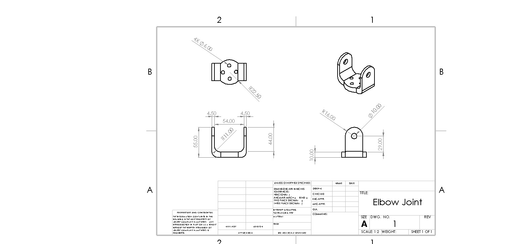
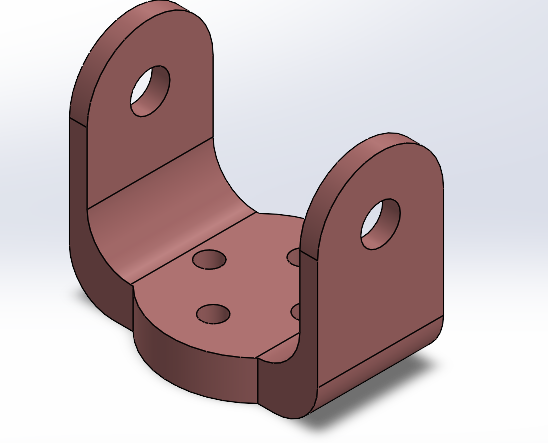
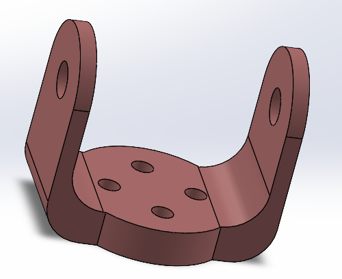

# Elbow-Joint-Design
# README for Task Three

## Table of Contents
1. [Overview](#overview)
2. [Methods](#methods)
3. [Features](#features)
4. [Output](#output)

---

## Overview

This is Task Three in the Mechanical Engineering track, submitted to Smart Methods Company for the 2025 Summer Internship. This task presents an elbow joint design of a full robot arm. The design is optimized using features like fillet and increasing thickness.

---

## Methods

The main software used is SolidWorks to design the joint. The model looks like a U-letter. Generally, the model is 55mm in height and 63mm in width; however, there are some constant dimensions (not allowed to change). For illustration, the internal distance between the U-ends is 54mm, the thickness of each end is 4.5mm, and the vertical distance between the side hole and the base is 29mm. 

*Figure 1: Drawing Sheet*

---

## Features

The optimized design has the following characteristics:

- Four base holes of 6mm diameter, allowing for light base and high stiffness.
- Fillet of 11mm radius for the base corners, as these corners are highly subjected to high stress concentrations. The high fillet radius reduces localized stress concentrations.
- Fillet of 16mm radius for the U-ends, preventing faster damage of the ends.

---

## Output

The model should be similar to the figures below. Additionally, the model is inserted as a SolidWorks Part format file in the repository for Finite Element Analysis (FEA) tests.

 

*Figure 2: Isometric View and Another View*
